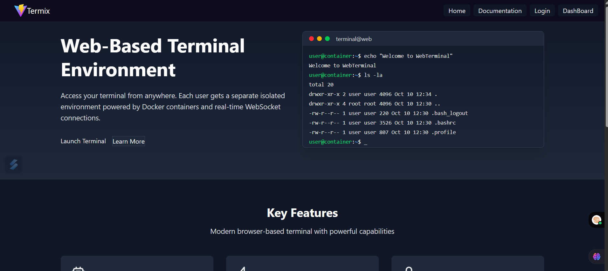
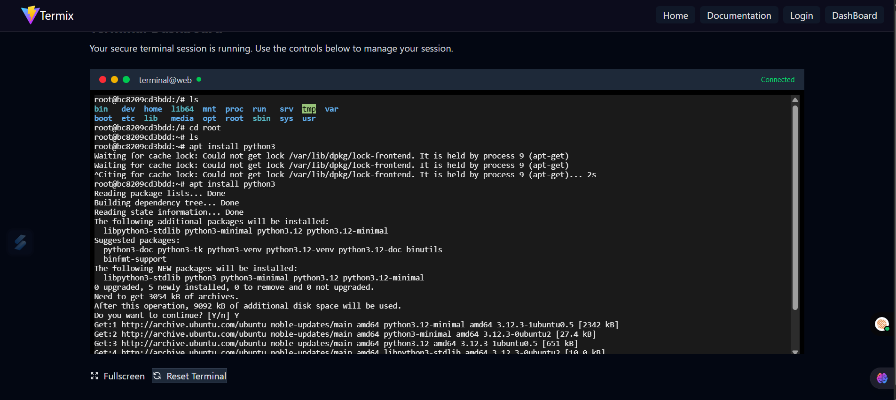

# 🌐💻 Web Terminal App

A **web-based terminal interface** that allows users to interact with a Linux environment directly from their browser. It's lightweight, fast, and customizable — perfect for learning, testing, or remote system management!

---

## 🧰 Tech Stack

- **Frontend**: Vite + React + Tailwind CSS
- **Backend**: Node.js + Express
- **Containerization**: Docker + Docker Compose
- **Shell Access**: `node-pty`, `xterm.js`
- **Deployment**: Netlify (Frontend), Render / Railway / Docker-based VPS (Backend)

---

## 🎨 Features

✅ Web-based Linux Terminal  
🎨 Colorful, responsive UI with syntax highlighting  
🔒 Isolated Docker containers for each session  
🚀 Fast, real-time shell interaction  
📚 Educational use — perfect for command-line practice  

---

## 🚀 Installation & Setup

### 📦 Requirements

Make sure the following are installed on your system:

- [Node.js](https://nodejs.org/)
- [Docker](https://www.docker.com/)
- [Git](https://git-scm.com/)

---

### 🛠️ Step-by-Step Installation

#### 1️⃣ Clone the Repository

```bash
git clone git@github.com:kamalesh0105/termix.git
cd web-terminal-app
```
###  2️⃣ Install Dependencies & Start Development Servers

## Client

```bash
cd client
npm install
npm run dev
```
## Server

```bash
cd server
npm install
npm run dev:server

```
### Demo

## Home


## Terminal



